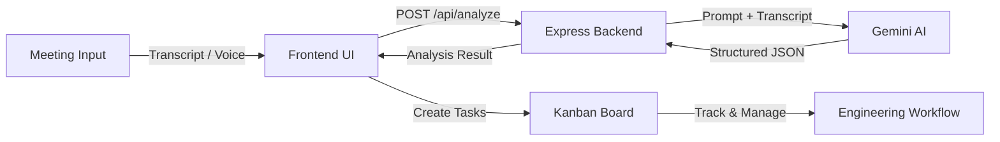

# AI Meeting-to-Action System — Implementation Plan

A web application that captures engineering meeting discussions (transcript or voice), uses Google Gemini AI to extract summaries, decisions, and action items, and integrates them into a built-in Kanban project board.

## Tech Stack

| Layer | Technology |
|-------|-----------|
| **Frontend** | Vanilla HTML/CSS/JS with premium modern design |
| **Backend** | Node.js + Express |
| **AI Engine** | Google Gemini API (gemini-2.0-flash) |
| **Voice Capture** | Web Speech API (browser-native) |
| **Workflow Board** | Built-in Kanban board (In-memory store) |
| **Architecture Diagram** | Mermaid (embedded in UI) |

## System Architecture

## Proposed Changes

### Project Setup

#### [NEW] [package.json](file:///c:/Protothon/package.json)
Node.js project with dependencies: `express`, `@google/generative-ai`, `dotenv`, `multer`, `cors`.

#### [NEW] [.env.example](file:///c:/Protothon/.env.example)
Template for `GEMINI_API_KEY` and `PORT`.

---

### Backend — Express API Server

#### [NEW] [server.js](file:///c:/Protothon/server.js)
Main server file with routes:
- `POST /api/analyze` — accepts transcript text, sends to Gemini AI, returns structured analysis (summary, decisions, action items)
- `GET /api/tasks` — returns all tasks on the board
- `POST /api/tasks` — creates a task from an extracted action item
- `PATCH /api/tasks/:id` — moves task between columns (Todo → In Progress → Done)
- `DELETE /api/tasks/:id` — removes a task
- Serves static frontend from `public/`

#### [NEW] [services/gemini.js](file:///c:/Protothon/services/gemini.js)
Gemini AI service:
- Configures the Gemini client with API key
- Sends a carefully crafted prompt that instructs Gemini to return JSON with: `summary`, `keyDiscussionPoints[]`, `decisions[]`, `actionItems[]` (each with `title`, `description`, `priority`, `assignee`, `category`)
- Parses and validates the response

#### [NEW] [services/taskStore.js](file:///c:/Protothon/services/taskStore.js)
In-memory task store simulating an issue tracker:
- CRUD operations for tasks with columns: `todo`, `in-progress`, `done`
- Each task has: `id`, `title`, `description`, `priority`, `category`, `assignee`, `status`, `createdAt`, `sourceContext`

---

### Frontend — Premium Modern UI

#### [NEW] [public/index.html](file:///c:/Protothon/public/index.html)
Single-page app with three main sections:
1. **Input Panel** — Textarea for transcript + voice recording button
2. **Analysis Dashboard** — Shows summary, key points, decisions, action items
3. **Kanban Board** — Drag-and-drop task board with Todo/In-Progress/Done columns

#### [NEW] [public/css/styles.css](file:///c:/Protothon/public/css/styles.css)
Premium dark-mode design with:
- Glassmorphism cards, gradient accents, smooth animations
- Google Font (Inter), custom color palette
- Responsive layout, hover effects, micro-animations

#### [NEW] [public/js/app.js](file:///c:/Protothon/public/js/app.js)
Main application logic:
- Tab navigation between Input → Analysis → Board
- Transcript submission via fetch API
- Voice recording using Web Speech API (`SpeechRecognition`)
- Rendering analysis results with animated cards
- Kanban board rendering with drag-and-drop
- One-click "Send to Board" for extracted action items

#### [NEW] [public/js/voice.js](file:///c:/Protothon/public/js/voice.js)
Voice capture module:
- Initializes `webkitSpeechRecognition` / `SpeechRecognition`
- Real-time transcript display during recording
- Start/stop controls with visual indicators

#### [NEW] [public/js/board.js](file:///c:/Protothon/public/js/board.js)
Kanban board module:
- Renders columns: Todo, In Progress, Done
- Drag-and-drop between columns using HTML5 Drag API
- Task cards with priority badges and context tooltips
- Add/move/delete operations via API calls

---

### Documentation

#### [NEW] [public/js/architecture.js](file:///c:/Protothon/public/js/architecture.js)
Renders the system architecture diagram using Mermaid.js in an "Architecture" tab.

## Verification Plan

### Automated — Browser Testing
1. Start the server: `cd c:\Protothon && node server.js`
2. Open `http://localhost:3000` in the browser
3. Paste the example transcript from the problem statement into the input area
4. Click "Analyze Meeting" and verify:
   - Summary section appears
   - At least 2 action items are extracted
   - Action items have title, description, priority
5. Click "Send to Board" on extracted action items
6. Navigate to the Kanban Board tab and verify tasks appear in the "Todo" column
7. Drag a task to "In Progress" and verify it moves

### Manual — Voice Input
- Click the microphone button, speak a short meeting excerpt, and verify the transcript populates in the text area
- *Note: Web Speech API requires Chrome and microphone access*

> [!IMPORTANT]
> The user must provide a valid **Gemini API key** in a `.env` file for the AI analysis to work. The system will prompt for this during setup.
